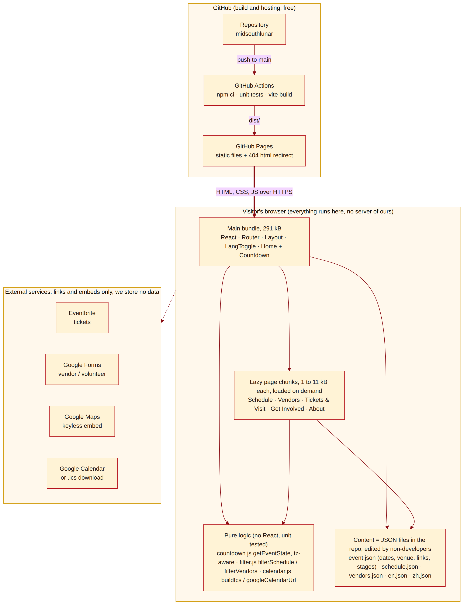

# Architecture and review (Tuesday lab, item 2)

The AI agent generated the diagram below from the code after the first build. We then reviewed it against the requirements document (Draft 3) and the handoff rules in Section 8, fixed what was wrong, and re-generated it.

Source: `architecture.mmd` (Mermaid, renders on GitHub). The pre-review version is in `architecture-before.mmd` / `architecture-before.png`.

## Update: artwork and chatbot (October 7)

The artwork and default chatbot remain compatible with static hosting. The optional AI service described below is separate from GitHub Pages.

- **Artwork is code.** The icon set, the goat mascot, and the background patterns are SVG inside React components and a CSS data URI, so there are no image files to host, license, or lose. The patterns cost about 6 kB of CSS.
- **The local chatbot runs in the browser.** `ChatWidget` loads the panel and engine lazily. The seven-language knowledge base and website JSON supply local answers. Event-location questions read the canonical venue data before activity lookup. An optional public `VITE_CHAT_API_URL` points to a separate protected Node service with server-only credentials; failures fall back locally. Clearing or switching language aborts requests and suppresses stale responses. See `CHAT_SETUP.md` for the current service architecture.
- **Bundle after the change:** main 328 kB raw / 107 kB gzip, inside the 350 / 110 budget. Lighthouse performance 98 to 99, accessibility 100.

## Update: chat service hosting (October 9)

The October 8 refactor moved the Gemini call out of the browser into `server/` (key stays server-side, the site only knows a public URL). That left a gap: GitHub Pages cannot run the Node service, and Draft 3 forbids a server the team operates, so the live site had no AI mode at all. `server/worker.mjs` packages the same service for Cloudflare Workers (free tier, no server to run, owned by the festival's accounts); `server/policy.mjs` holds the origin allowlist and rate limiter shared by both entries. `.github/workflows/chat-worker.yml` redeploys the Worker when `server/`, `src/data/` or `src/i18n/` change, because the Worker bundles that JSON as its grounding. Nothing in the static site changed; it still reads `VITE_CHAT_API_URL` at build time.

## What the diagram shows

- **GitHub hosts the static website.** A push to `main` runs the unit tests, builds the site, and publishes `dist/` to GitHub Pages. The website works without credentials, a database or an AI account. Optional live AI uses an independently hosted service and MCCC-controlled account; browser builds receive only its public endpoint URL.
- **Everything else runs in the visitor's browser.** React renders the pages, the pure-logic modules do the countdown, filtering, and calendar work, and all content comes from JSON files that ship with the site.
- **Content is data, not code.** `event.json`, `schedule.json`, `vendors.json`, `en.json`, and `zh.json` can be edited in GitHub's web editor by someone at MCCC without touching a component (HO-10, HO-11).
- **Ticketing remains external.** Eventbrite, Google Forms, Google Maps and Google Calendar use links, downloads or a keyless iframe. The website processes no payments. Optional AI sends bounded chat context to the configured service/provider, with a visitor notice.

## What the review found

Prompt to the agent: *"Review the architecture diagram against docs/requirements/REQUIREMENTS.md, especially Sections 7 and 8. Is anything wrong from an application perspective? List concrete problems with evidence, not style preferences."*

### Finding 1: one JavaScript bundle for all six pages (fixed)

The first diagram showed `main.jsx` feeding every page from one 316 kB file. A visitor who only wants the schedule on their phone at the festival was downloading the About page, the FAQ, and the vendor directory too. NFR-2 is mobile first.

**Change:** route-level code splitting with `React.lazy`. Home stays in the main bundle because it is the landing page; the other five pages load on demand.

**Did it work better?** Partly. The main bundle dropped from 316 kB to 291 kB (gzip 102 kB to 95 kB) and the five page chunks are 1 to 11 kB each. The remaining 291 kB is React, React Router, and the Home page itself, so the split helps the schedule and vendor pages but does not transform load time. The honest conclusion is that the biggest cost is the framework, which was a deliberate choice for maintainability, and the site is still well within the performance budget (see `TEST_REPORT.md`). If this ever mattered, the next step would be swapping React Router for a smaller router, not more splitting.

### Finding 2: the time-zone offset was hard-coded (fixed)

`countdown.js` built festival times with a literal `-06:00`. That is correct for February in Memphis, but `event.json` declares `"timezone": "America/Chicago"` and the code ignored it. HO-10 says MCCC should be able to reuse the site for 2028 by editing data. If a future event (a Lantern Festival follow-up in March, say) fell inside daylight time, every countdown and calendar entry would be off by an hour and nobody editing JSON would know why.

**Change:** `festivalDate()` now resolves the offset from `event.timezone` using the browser's built-in `Intl` support, so a date in July correctly resolves to UTC-5 and a date in February to UTC-6. No library added.

**Did it work better?** Yes, verified by unit test (`countdown.test.js`, "handles daylight time"). Behavior for the 2027 festival is unchanged.

### Finding 3: deploy workflow depended on a script that did not exist yet (fixed)

The workflow called `npm run test:unit` before build, but that script was only planned for the Thursday lab. The first push would have failed the deploy. **Change:** the Vitest setup was pulled forward so the pipeline is green from the first deploy, which also means every content edit by MCCC gets the unit tests run against it for free.

### Finding 4: the Chinese dictionary is an unreviewed AI draft (open, by design)

Not an architecture flaw but visible in the diagram: `zh.json` is marked `pending review`. Section 6 of the requirements says no unreviewed translation goes live. The site is live for peer testing with the draft in place and a visible note in the file. **Action:** Dee Dee or Wang reviews `zh.json` before the final deliverable.

### Things the review checked and found fine

- No secrets or API keys anywhere in the repo (NFR-8 in Draft 2, NFR-6 in Draft 3). The Google Map uses the keyless embed URL.
- The site works with JavaScript errors in one page confined to that page's chunk; the layout and navigation still render.
- Filters live in the URL (`/schedule?day=day2&type=performance`), so a filtered view can be shared or printed as a QR code.
- The `404.html` redirect means direct links work on GitHub Pages (decision 10.3 in Draft 3, resolved by using the redirect file).
- Language choice persists in `localStorage` and the site still works if storage is blocked.
